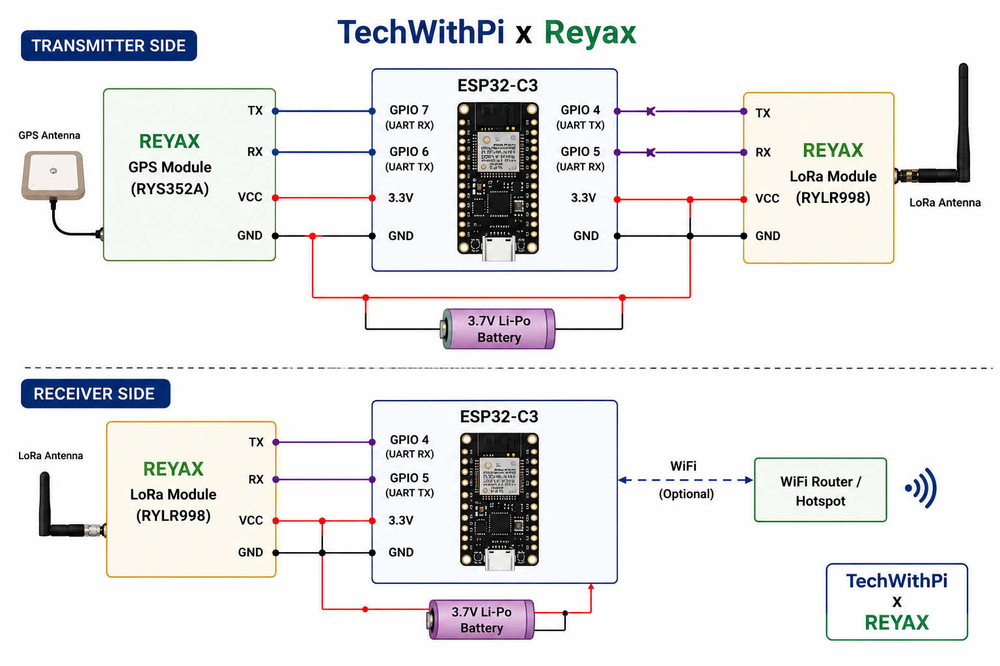

# ESP32-LoRa-GPS-Tracker
A real-time long-range GPS tracker using ESP32-C3, Reyax RYLR998 LoRa module, and Reyax RYS352A GPS module. This project enables live GPS tracking on a web map without using a SIM card or mobile network.

