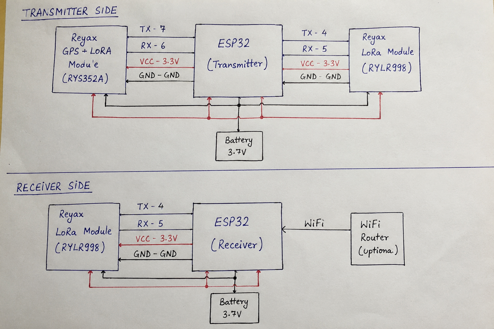

# ESP32-LoRa-GPS-Tracker
A real-time long-range GPS tracker using ESP32-C3, Reyax RYLR998 LoRa module, and Reyax RYS352A GPS module. This project enables live GPS tracking on a web map without using a SIM card or mobile network.

🔌 Connections

📡 Transmitter Side

Reyax RYS352A GPS Module → ESP32-C3

GPS Module| ESP32-C3
TX| GPIO7
RX| GPIO6
VCC| 3.3V
GND| GND

---

Reyax RYLR998 LoRa Module → ESP32-C3

LoRa Module| ESP32-C3
TX| GPIO4
RX| GPIO5
VCC| 3.3V
GND| GND

---

📶 Receiver Side

Reyax RYLR998 LoRa Module → ESP32-C3

LoRa Module| ESP32-C3
TX| GPIO4
RX| GPIO5
VCC| 3.3V
GND| GND
